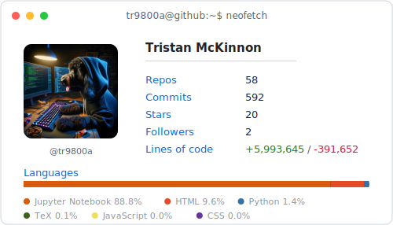

<picture>
  <source media="(prefers-color-scheme: dark)"  srcset="./dark_mode.svg">
  <source media="(prefers-color-scheme: light)" srcset="./light_mode.svg">
  
</picture>

<!--
Stats card auto-generated daily by .github/workflows/build.yaml.
Stats engine vendored from jstrieb/github-stats (GPL-3.0):
https://github.com/jstrieb/github-stats — see LICENSE.
-->
